# 📚 BookEase – Book Management Application

BookEase is a Django-based web application that allows **publishers** to publish, edit, and delete their books, while **admins** can approve, edit, or delete any book and even manage users.

  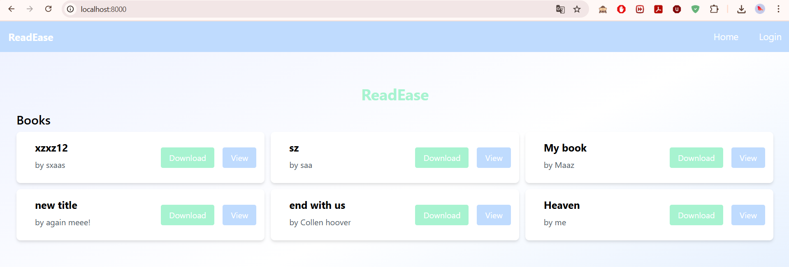
  
---

## 🔐 User Authentication

### 1. Register
Users can create a new account by providing a username, email, and password.  

**Screenshot:**  
  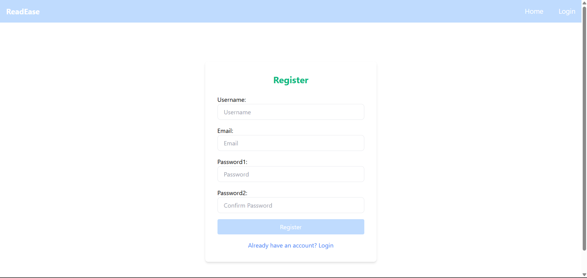

### 2. Login
Registered users can login to access their dashboard.  

- **Admin login:**  
  - Username: `admin`  
  - Password: `12345678`  

**Screenshot:**  
  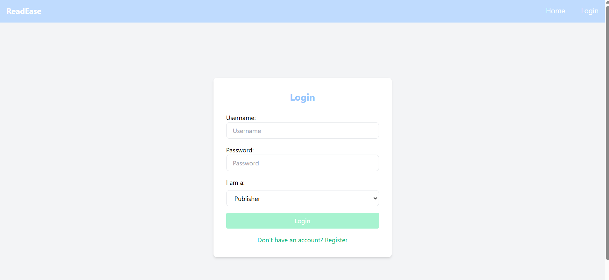

### 3. Logout
Users can securely logout from the platform.  

---

## 🚀 Features

### 1. Publisher Features    
- Add new books with details (title, author, description, etc.).  
  **Screenshot:**  
    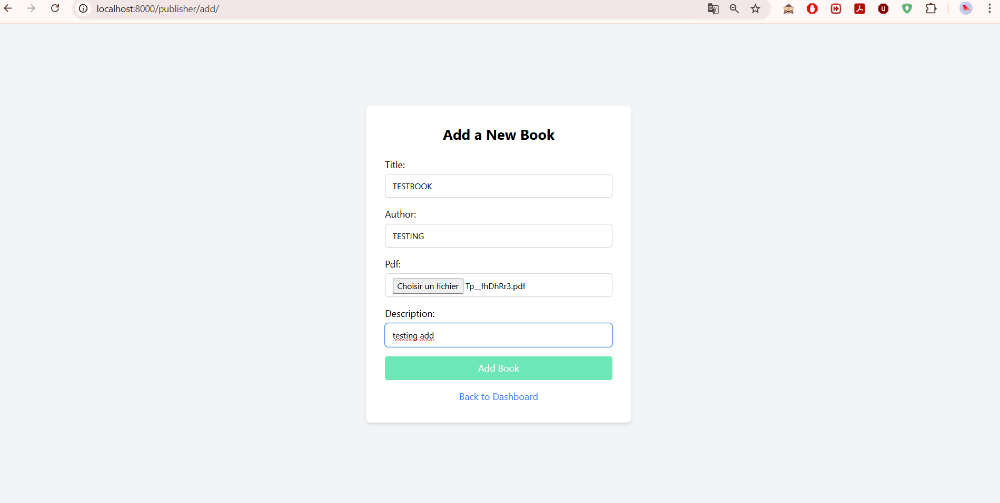
    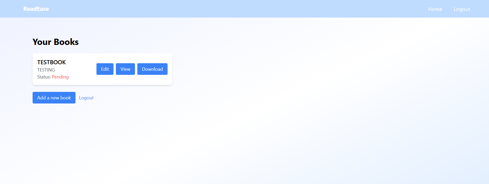


- Edit existing books.  
  **Screenshot:**  
    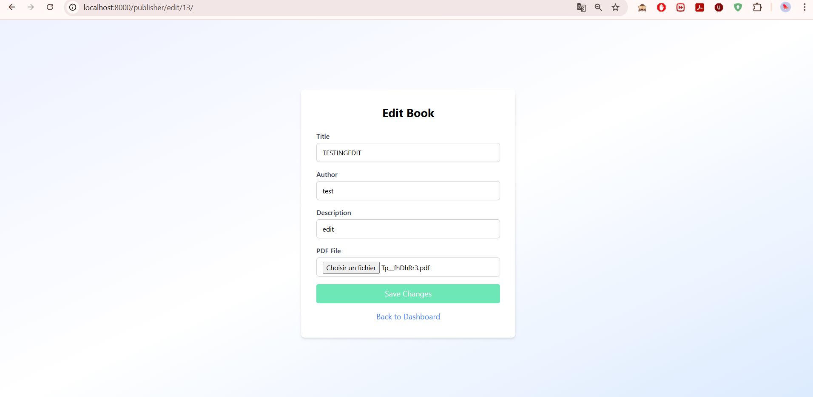

- View a list of their submitted books.  
  **Screenshot:**  
    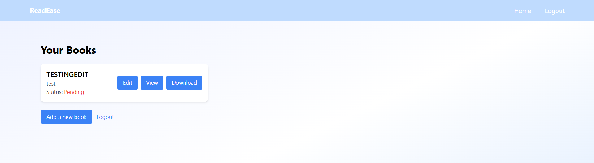

### 2. Admin Features
- Approve or reject books submitted by publishers.  
  **Screenshot:**  
    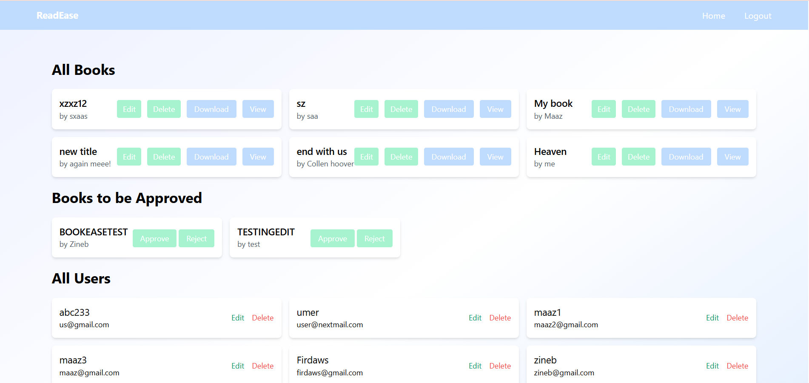
    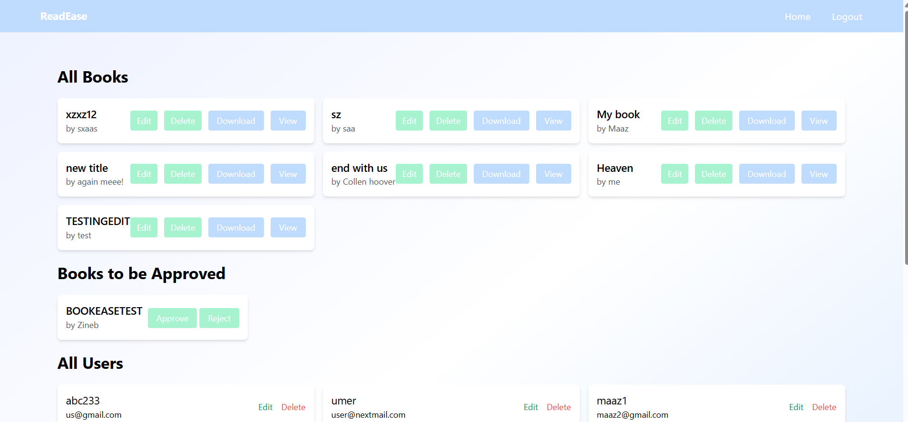


- Edit or delete any book on the platform.  
  **Screenshot:**  
    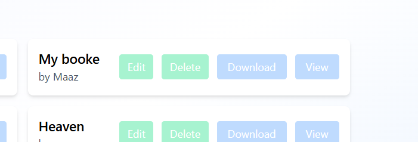
    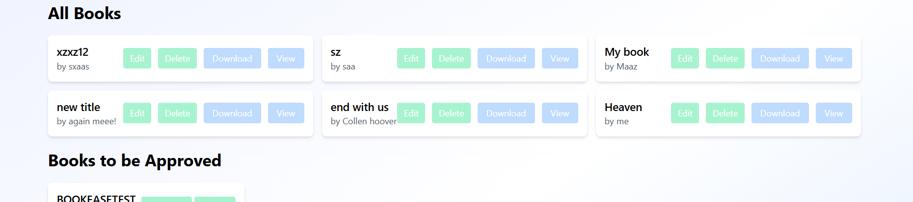


- Manage users (remove users if necessary).  
  **Screenshot:**  
    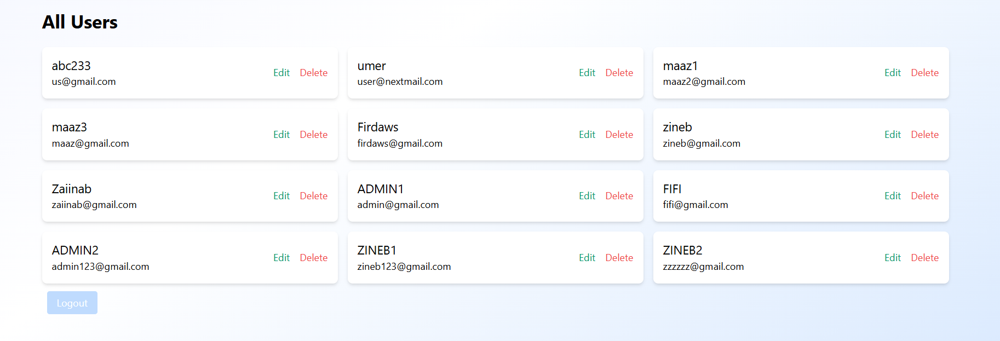


---

---

## ⚙️ How to Run the Project
1. Make sure **Python** is installed.  
2. Unzip the project and open a terminal in the folder.  
3. Create a virtual environment:  
   ```bash
   python -m venv env
4. Activate the environment :
   ```bash
    pip install -r requirements.txt
5. Install dependencies :
   ```bash
   .\env\Scripts\activate

6. Then open your browser at :
   ```bash
    http://127.0.0.1:8000
7. Run the server :
    ```bash
    python manage.py runserver
 ---
 
 **Zineb Feth-Eddine**


